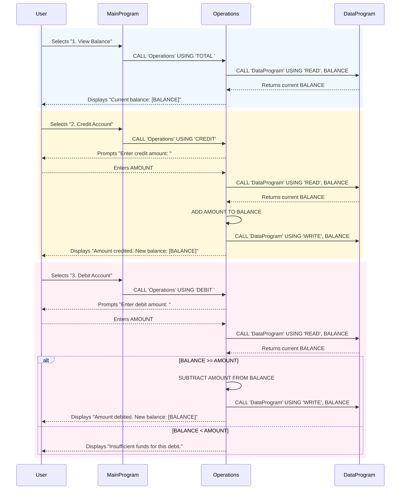

# COBOL Student Account Management System

This project contains a legacy COBOL-based system for managing student accounts. The system allows students to view their account balance, credit funds, and debit funds with appropriate business rules.

## COBOL Files Overview

### data.cob (DataProgram)
**Purpose**: Serves as the data layer for persistent storage of account balance information.

**Key Functions**:
- `READ`: Retrieves the current balance from storage
- `WRITE`: Updates the balance in storage

**Technical Details**:
- Uses a working storage variable `STORAGE-BALANCE` initialized to 1000.00
- Accepts operation type and balance parameters via linkage section
- Handles read/write operations based on the passed operation type

### main.cob (MainProgram)
**Purpose**: Provides the main user interface and program flow control for the account management system.

**Key Functions**:
- Displays a menu-driven interface with options for account operations
- Processes user input and routes to appropriate operations
- Manages program execution loop until user chooses to exit

**Menu Options**:
1. View Balance - Displays current account balance
2. Credit Account - Adds funds to the account
3. Debit Account - Subtracts funds from the account (with validation)
4. Exit - Terminates the program

### operations.cob (Operations)
**Purpose**: Implements the core business logic for account operations including credits, debits, and balance inquiries.

**Key Functions**:
- `TOTAL`: Displays the current account balance
- `CREDIT`: Adds a specified amount to the account balance
- `DEBIT`: Subtracts a specified amount from the account balance (with validation)

## Business Rules for Student Accounts

### Account Initialization
- All student accounts start with an initial balance of $1000.00

### Credit Operations
- Students can credit any positive amount to their account
- Credits are immediately added to the account balance
- No upper limit on credit amounts

### Debit Operations
- Students can debit amounts from their account only if sufficient funds are available
- If the debit amount exceeds the current balance, the transaction is rejected with an "Insufficient funds" message
- Valid debits are immediately subtracted from the account balance

### Balance Viewing
- Students can view their current balance at any time
- Balance is displayed in dollars and cents format (e.g., 1000.00)

### Data Persistence
- Account balance is maintained in memory through the data program
- Balance persists across operations within a single program execution
- No external database or file persistence is implemented

## System Architecture

The system follows a modular architecture:
- **MainProgram**: Entry point and user interface
- **Operations**: Business logic layer
- **DataProgram**: Data access layer

All programs communicate through COBOL CALL statements and linkage sections, demonstrating traditional mainframe-style program structure.

## Sequence Diagram

The following sequence diagram illustrates the data flow for typical account operations (view balance and credit account):

